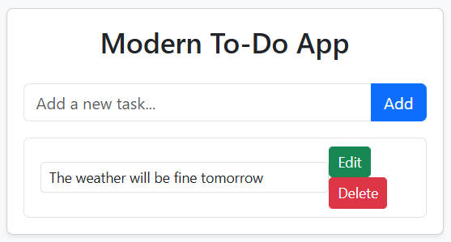

# Modern To-Do App

A responsive and user-friendly To-Do application with secure authentication and real-time task management. This app is built using modern technologies to ensure a seamless experience.

## Features

- **User Authentication**: Secure signup, login, and logout.
- **Task Management**: Add, edit, and delete tasks in real time.
- **Responsive Design**: Optimized for devices of all sizes.
- **Secure Data**: User-specific task lists using Supabase.

## Technologies Used

- **Frontend**: HTML, JavaScript, Bootstrap 5
- **Backend**: Supabase (PostgreSQL & Authentication)
- **Hosting**: Netlify

## Live Demo

Check out the app: [Modern To-Do App](https://shimmering-cascaron-180d19.netlify.app/)

## Can Run

1. Clone the repository:
   ```bash
   git clone https://github.com/yourusername/modern-todo-app.git

2. Navigate to the project directory:
    ```bash
    cd modern-todo-app

## Screenshots

Here is a preview of the application:


